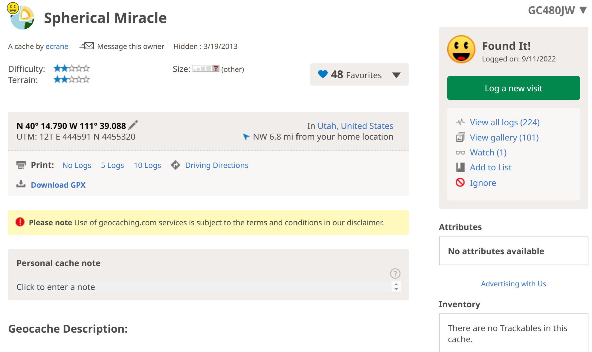

# Geocache: What is it? 
Geocaching is the world’s largest treasure hunt. The first geocache was hidden on May 3rd, 2000 and
since then over 3 million more geocaches have been hidden across 191 different countries and all 7
continents. There are over 300,000 cache owners in the world. In 2020 a geocache tagged along for a
ride to Mars with NASA’s Perseverance rover and landed in the Jezero Crater in early 2021, marking
the first interplanetary geocache. With such a buzz about geocaching, it is only natural to wonder what
makes a good geocache.

No two geocaches are the same. Some are placed in difficult-to-reach places (see the geocache on
Mars above), others are easy to get to but craftily hidden. A cache’s “Terrain” rating indicates the
physical effort that will be needed to get to the cache while a cache’s “Difficulty” rating indicates the
amount of effort that will go into solving or finding the cache. Some geocaches are as large as a boulder,
others are as small as a thimble. When a geocacher finds a geocache they have the option to grant that
cache a “favorite”, similar to a “like” on social media. The goal of our analysis is to determine whether
a cache’s Terrain or Difficulty rating affects the number of favorites it receives.

# The Data
We scraped the data of 140,000 geocaches hidden in Utah and California, getting the ID, Difficulty,
Terrain, Date Hidden, and number of Favorites.

# Our Model

The favorite measure is quantified as a count, prompting our selection of a Poisson likelihood. There are
nine groups each for terrain and difficulty. In the model depicted below, every group received their own
rate parameter, which follows to a Gamma distribution. Additionally, we imposed priors on the alpha
and beta parameters for each group, resulting in a total of 27 parameters to be estimated.
For the alpha and beta priors, we opted for parameters that would yield an expected count of
approximately five favorites for each group. This decision was made due to our limited insight into the
mean count for each group, assuming a uniformity across them.

$$
y_{i} \mid \lambda_{i} \sim \text{Pois}(\lambda_{i})
$$

$$
\lambda_{i} \mid \alpha_{i}, \beta_{i} \sim \text{Gamma}(\alpha_{i},\beta_{i})
$$

$$
\alpha_{i} \mid c, d \sim \text{Gamma}(c,d)
$$

$$
\beta_{i} \mid e, f \sim \text{Gamma}(e,f)
$$

Where \( y_i \) is the number of favorites a given cache has received. 

The prior parameters are:
- \( c = 5 \)
- \( d = 1 \)
- \( e = 1 \)
- \( f = 1 \)

Our objective was to sample the posterior distribution for each group manually and through a Probabilistic Programming Language (PPL). This approach allows us to infer whether there are differences between the groups based on favorites.

# Sampling
## By Hand 
For the by-hand approach, we first needed to start with our joint posterior density, as shown below:

$$
p(\lambda_{i} \mid \alpha_{i}, \beta_{i}, c, d, e, f, y_{1}, \ldots, y_{m}) \propto p(y \mid \lambda_{i}) p(\alpha_{i} \mid c, d) p(\beta_{i} \mid e, f)
$$

$$
\quad \prod_{i=1}^{n}\prod_{j=1}^{m} \frac{\lambda^{y_{ij}} e^{-\lambda_{i}}}{y_{ij}!} \frac{\beta_{i}^{\alpha_{i}}}{\Gamma(\alpha_{i})} \lambda_{i}^{\alpha_{i}-1} e^{-\beta_{i} \lambda_{i}} \frac{d^{c}}{\Gamma(c)} \alpha_{i}^{c-1} e^{-d \alpha_{i}} \frac{f^{e}}{\Gamma(e)} \beta_{i}^{e-1} e^{-f \beta_{i}}
$$

The approach we wanted to take was to derive the full conditionals of \(\lambda\), \(\alpha\), and \(\beta\) for each group. To derive the full conditionals, we took the log of the joint. Below are the full conditionals for the parameters:

$$
(\lambda_{i} \mid \cdot) = \sum_{j=1}^{m} [y_{ij} \log(\lambda_{i})] - m \lambda_{i} + (\alpha_{i} - 1) \log(\lambda_{i}) - \beta_{i} \lambda_{i}
$$

$$
(\alpha_{i} \mid \cdot) = \alpha_{i} \log(\beta_{i}) - \log(\Gamma(\alpha_{i})) + \alpha_{i} \log(\lambda) + (c - 1) \log(\alpha_{i}) - d \alpha_{i}
$$

$$
(\beta_{i} \mid \cdot) \sim \text{Gamma}(\alpha_{i} + e, \lambda_{i} + f)
$$
